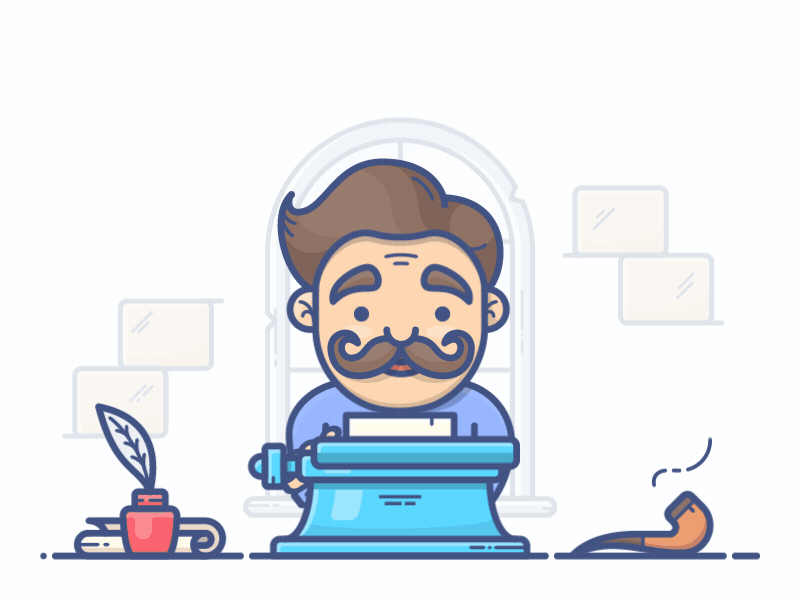

<!--
**Moeez Mustafa** is a ✨ _special_ ✨ repository because its `README.md` (this file) appears on your GitHub profile.

Here are some ideas to get you started:

- 🔭 I’m currently working on ...
- 🌱 I’m currently learning ...
- 👯 I’m looking to collaborate on ...
- 🤔 I’m looking for help with ...
- 💬 Ask me about ...
- 📫 How to reach me: ...
- 😄 Pronouns: ...
- ⚡ Fun fact: ...
-->
<h1 align="center">Hi , Moeez Here !</h1>

<!--  -->

  
<!-- 

<h2> 
 

 -->
 
<!--  <h2>

  

  

 -->

## About me
 I am a Designer Turned Programmer , I code and work in the domain of automation 
 I believe in learning by building and being consistent in what I do.  
 Being a polyglt in programming languages feels really great 
 Full Stack Front-End , Automation and C++ and Python Development 
 Aiming towards Advancing my skills to crack GSOC ✨✨ 
 When i code it makes me feels like i am playing piano , just that my music notes are key presses and my music is a software tool.

 
 

## Hacktoberfest Badges 

 
 

## My Recent Blog posts ✍️
- [Free Website Hosting ! with GitHub Pages](https://moezmustafa.medium.com/free-website-hosting-with-github-pages-4ebeedbd8d82)
- [Build a Website in 20min : React Bricks !](https://moezmustafa.medium.com/react-bricks-create-a-site-in-20min-448be5ec1df4)
- [Bash Scripting : Get Started !](https://moezmustafa.medium.com/bash-scripting-get-started-89d5e3756cc9)
- [JavaScript Versions: ES6 and Before](https://moezmustafa.medium.com/javascript-versions-es6-and-before-4182e8a43626)
- [Learned Git/GitHub in 3 days](https://moezmustafa.medium.com/learned-git-github-in-3-days-b1eb3deca0da)
- [Rubber Ducky Method](https://moezmustafa.medium.com/rubber-ducky-method-f80907a83853)

 

<!-- ## Challanges Ive Done 

  -->
<!-- 
## Tech Stack 🚀

  -->

<!--  

## Design Stack

 -->

<!-- ## Ui/Ux Stack

 -->

<!-- ## Tools I Use ✨

  -->

## Connect with me 🤙

 

## GitHub Streak 🔥🔥

    

## ❤ Views and Followers

## My GitHub Stats 😎

